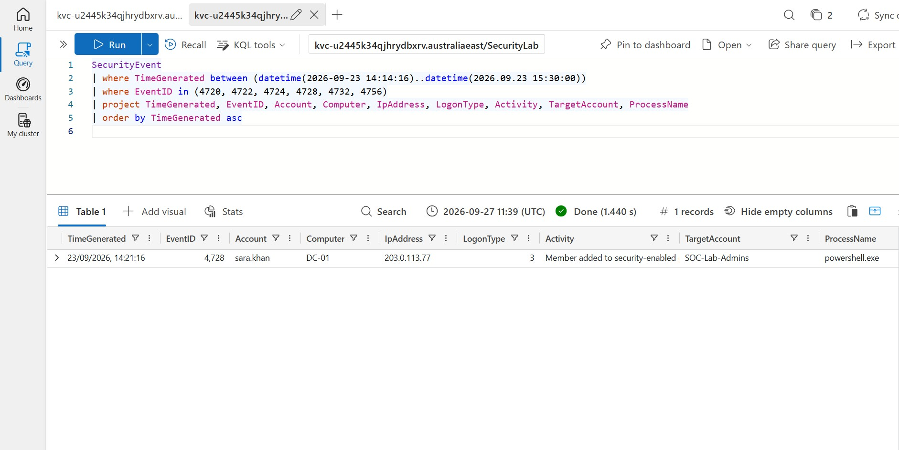
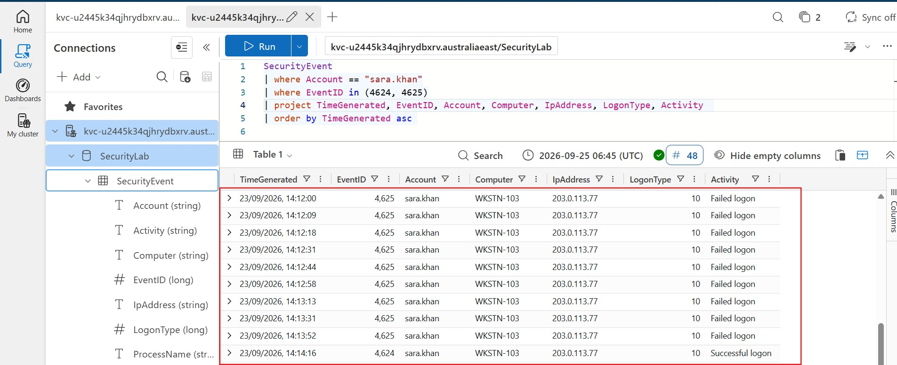
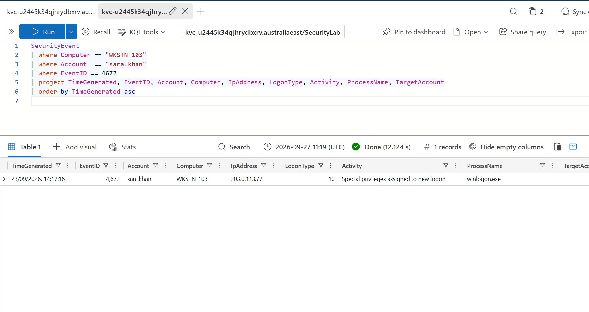
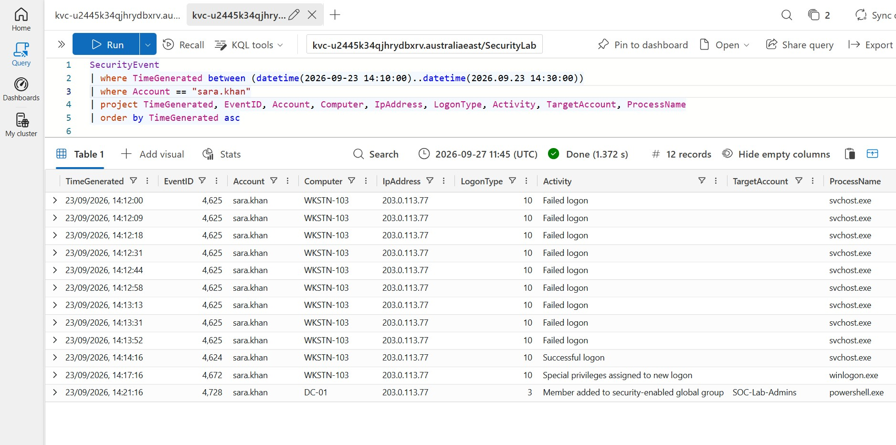
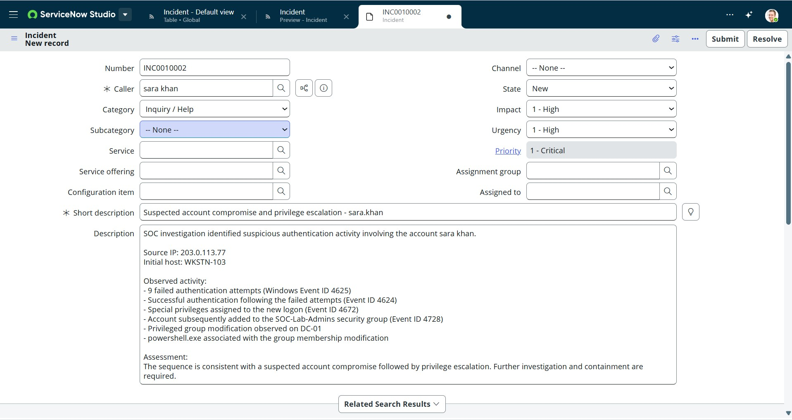
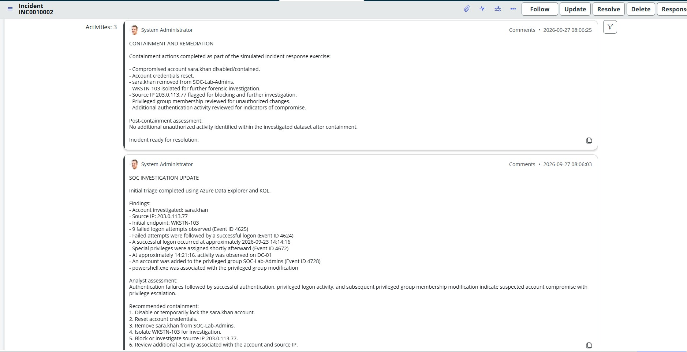

# Azure SOC Incident Response Lab

## Overview

This project demonstrates an end-to-end Security Operations Center (SOC) investigation and incident-response workflow using **Azure Data Explorer, Kusto Query Language (KQL), Windows Security Events, and ServiceNow**.

The lab simulates a suspected account compromise involving repeated authentication failures, a subsequent successful logon, privileged logon activity, and unauthorized membership in a privileged security group.

The investigation focused on identifying suspicious activity, correlating Windows Security Events, reconstructing the incident timeline, documenting findings, and performing a simulated containment and remediation workflow.

> **Note:** This is a controlled cybersecurity lab. All accounts, IP addresses, hosts, events, and containment actions shown in this project are simulated and do not represent a real production incident.

---

## Technologies Used

- Azure Data Explorer
- Kusto Query Language (KQL)
- Windows Security Event Logs
- ServiceNow
- GitHub
- SOC investigation methodology
- Incident response methodology

---

## Incident Scenario

Suspicious authentication activity was investigated involving the account:

`sara.khan`

The investigation identified repeated failed authentication attempts originating from:

`203.0.113.77`

against the workstation:

`WKSTN-103`

The failed authentication attempts were followed by a successful authentication and subsequent privileged activity.

The objective was to determine whether the sequence represented normal user activity or evidence of a potential account compromise and privilege escalation.

---

## Key Security Events

| Event ID | Description | Investigation Relevance |
|---|---|---|
| 4625 | Failed logon | Identified repeated authentication failures |
| 4624 | Successful logon | Successful authentication following the failures |
| 4672 | Special privileges assigned to new logon | Indicated privileged logon activity |
| 4728 | Member added to a security-enabled global group | Identified privileged-group membership modification |

---

## Investigation Process

### 1. Authentication Analysis

KQL was used to investigate authentication activity associated with `sara.khan`.

The analysis identified:

- **9 failed authentication attempts**
- **1 successful authentication**
- Source IP: `203.0.113.77`
- Initial host: `WKSTN-103`

The successful authentication occurred shortly after the repeated failures, making the sequence worthy of further investigation.

### Evidence



---

### 2. Failed-to-Successful Logon Correlation

Windows Event IDs **4625** and **4624** were correlated to reconstruct the authentication sequence.

The investigation showed multiple failed authentication attempts followed by a successful logon from the investigated source IP.

### Evidence



---

### 3. Privileged Logon Investigation

Following the successful authentication, additional events associated with the account and workstation were investigated.

Windows Event ID **4672** showed that special privileges were assigned to the new logon session involving:

- Account: `sara.khan`
- Host: `WKSTN-103`
- Source IP: `203.0.113.77`

This increased the severity of the investigation because privileged activity followed the suspicious authentication sequence.

### Evidence



---

### 4. Privileged Group Membership Modification

Further investigation identified Windows Event ID **4728**.

The event showed the account being added to:

`SOC-Lab-Admins`

The activity occurred on:

`DC-01`

The event was also associated with:

`powershell.exe`

The privileged-group modification following the suspicious authentication and privileged logon activity was treated in this lab as evidence of suspected privilege escalation.

### Evidence



---

## Attack Timeline

The investigation reconstructed the following sequence:

1. Multiple failed authentication attempts were observed against `sara.khan`.
2. Nine Event ID 4625 failures were identified from `203.0.113.77`.
3. A successful Event ID 4624 authentication followed the failures.
4. Event ID 4672 indicated special privileges were assigned to the new logon.
5. Additional activity was observed involving `DC-01`.
6. Event ID 4728 showed the account being added to the privileged `SOC-Lab-Admins` group.
7. `powershell.exe` was associated with the privileged-group modification.
8. The activity was escalated into a simulated Priority 1 security incident.

---

## Analyst Assessment

The combination of repeated authentication failures, a subsequent successful authentication, privileged logon activity, and privileged-group membership modification was assessed in the lab as a **suspected account compromise followed by privilege escalation**.

Rather than relying on a single event, the investigation correlated multiple Windows Security Events to reconstruct the sequence of activity.

---

## ServiceNow Incident Management

The findings were documented in ServiceNow as a **Priority 1 – Critical** incident.

The incident record included:

- Affected account
- Source IP address
- Initial affected workstation
- Relevant Windows Event IDs
- Authentication findings
- Privileged activity
- Analyst assessment
- Recommended containment actions

### Evidence



---

## Containment and Remediation

As part of the simulated incident-response exercise, the following containment and remediation actions were documented:

- Contained the suspected compromised account
- Reset account credentials
- Removed unauthorized privileged-group membership
- Isolated `WKSTN-103` for further investigation
- Flagged `203.0.113.77` for blocking and additional investigation
- Reviewed privileged-group membership for unauthorized changes
- Reviewed additional authentication activity for indicators of compromise

A post-containment review found no additional unauthorized activity within the investigated lab dataset.

---

## Incident Resolution

Following the simulated containment and remediation process, the investigation findings and response actions were documented in ServiceNow and the incident was resolved.

### Evidence



---

## KQL Threat Hunting

KQL queries were created throughout the investigation to analyze and correlate the security events.

The queries included:

- Failed authentication analysis
- Successful authentication investigation
- Account-specific activity
- Source-IP investigation
- Authentication timeline reconstruction
- Event ID correlation
- Privileged logon investigation
- Privileged-group modification hunting

The KQL queries used in this investigation are available in the [`kql`](./kql) directory.

---

## Repository Structure

```text
azure-soc-incident-response-lab/
│
├── kql/
│   └── KQL investigation queries
│
├── 01-authentication-summary.jpg
├── 02-failed-to-successful-logon.jpg
├── 03-special-privileges-4672.jpg
├── 04-admin-group-membership-4728.jpg
├── 05-servicenow-incident.jpg
├── 06-servicenow-resolution.jpg
│
└── README.md
```

---

## Skills Demonstrated

This project demonstrates practical experience with:

- SOC alert investigation
- Security log analysis
- KQL threat hunting
- Windows Security Event analysis
- Authentication-event investigation
- Event correlation
- Privilege-escalation investigation
- Attack timeline reconstruction
- Incident triage
- Evidence documentation
- Containment planning
- Remediation planning
- ServiceNow incident management
- Technical incident reporting

---

## Investigation Conclusion

This lab demonstrates an end-to-end SOC investigation from initial suspicious authentication activity through incident resolution.

Using **Azure Data Explorer and KQL**, multiple Windows Security Events were correlated to reconstruct a sequence involving repeated authentication failures, successful authentication, privileged logon activity, and privileged-group membership modification.

The investigation was then documented and managed through **ServiceNow**, including analyst findings, simulated containment, remediation, and incident resolution.

The overall SOC workflow demonstrated in this project was:

**Detect → Investigate → Correlate → Assess → Document → Contain → Remediate → Resolve**

---

## Disclaimer

This project was created in a controlled lab environment for cybersecurity training and portfolio demonstration purposes.

All users, IP addresses, hosts, security events, attack activity, and incident-response actions shown in this repository are simulated.
